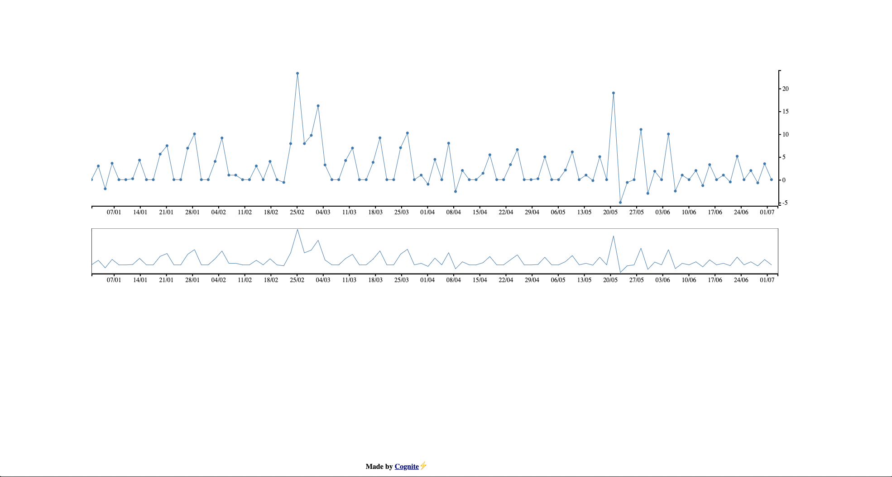

# Griff Demo

This is a demo of [Griff](https://github.com/cognitedata/griff-react), a charting & plotting library for data. The example fetches data from [NOAA](https://www.noaa.gov/) and displays a representation of the data, more accurately a monthly summary of weather in Anaheim, California, January 1st - July 4th 2018 🌦.



## Introduction

Griff is a charting library made for visualizing a sequence of data, known as time series and making sure data is updated. This means that Griff itself is responsible for updating the data and handling aggregates of a data source. With this in mind, you will be able to either have dynamic charts in real-time, static charts that have fixed data, or provide multiple sources of data to a single chart. Griff is performant while supporting complex graphs and plotting those.

Feel free to [read more](https://github.com/cognitedata/griff-react/blob/master/README.md) about what Griff does, join the [slack channel](cognite-community.slack.com) and give feedback about what or how Griff could do better.

This demo gives an example of how you can use a rest-api outside of Griff to render data, altough this is the simplest form you can have of plotting in Griff. Griff provides features such as scatter plots, data polling, integration with other plotting libraries such as [ChartJS](https://www.chartjs.org/), [Plotly](https://github.com/plotly/plotly.js) and much more. Check out the [storybook for more examples](https://griff-master.surge.sh)

## Installation

```sh
$ git clone https://github.com/evenstensberg/griff-demo.git
$ cd griff-demo
$ npm install
```

# Trying it out

After running `npm install`, a local dev-server should be starting at [`http://localhost:8090`](http://localhost:8090). You'll need to change the `apiToken` found in the first lines of [`src/index.js`](./src/index.js).
You can get your API token from NOAA [here](https://www.ncdc.noaa.gov/cdo-web/token).

# Contributing

Griff is Open Source and the project is open to contributions of any sort. If the change is a documentation change, code related or using Griff, **please** [submit an issue](https://github.com/cognitedata/griff-react/issues/new) or **submit** a [pull request](https://github.com/cognitedata/griff-react/compare). If you are interested in contributing to the project, you can have a look at the [issues list](https://github.com/cognitedata/griff-react/issues) or come up with suggestions yourself, which is much appreciated.

If you are interested in other contribute to other repositories, please check out the [Cognite](https://www.cognite.com/) on [Github](https://github.com/cognitedata)